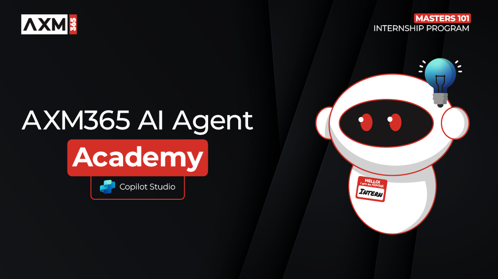

# Copilot Studio Agent Academy

**Welcome, Intern.**  
Your mission—should you choose to accept it—is to master the art of building agents using **Microsoft Copilot Studio**.

This hands-on training is your entry point into the **world of agents**: from grounded prompts to Adaptive Cards and agent flows, you'll learn how to build and scale intelligent agents using real-world tools and use cases.

---

## 🎯 Mission Objective

By completing the Agent Academy, you'll be able to:

- Understand what agents are in the context of Microsoft Copilot Studio
- Explore how Large Language Models (LLMs), retrieval-augmented generation (RAG), and orchestration come together in an agent
- Build both **declarative** and **custom agents**
- Enhance agents with **Topics**, **Adaptive Cards**, and **Agent Flows**

---

## 🧭 Curriculum Overview

This academy is broken into progressive lessons—each one designed as a field mission to level up your agent-building skills.

| Lesson | Title | Mission Briefing |
|--------|-------|------------------|
| `00` | 🧰 [Course Setup](./docs/recruit/00-course-setup/README.md) | Set up your dev environment, Copilot Studio trial, and SharePoint site |
| `01` | 🧠 [Introduction to Agents](./docs/recruit/01-introduction-to-agents/README.md) | Understand conversational AI concepts, LLMs, and autonomous vs. declarative agents |
| `02` | 🛠️ [Copilot Studio Fundamentals](./docs/recruit/02-copilot-studio-fundamentals/README.md) | Learn the building blocks: knowledge, skills, autonomy |
| `03` | 👩‍💻 [Create a Declarative Agent](./docs/recruit/03-create-a-declarative-agent-for-M365Copilot/README.md) | Add your own agent to the Microsoft 365 Copilot, grounded in a prompt |
| `04` | 🧩 [Creating a Solution](./docs/recruit/04-creating-a-solution/README.md) | Package your agent into a reusable solution for environment management |
| `05` | 🚀 [Get Started with Pre-Built Agents](./docs/recruit/05-using-prebuilt-agents/README.md) | Use and customize a template agent to accelerate setup |
| `06` | ✍️ [Build a Custom Agent](./docs/recruit/06-create-agent-from-conversation/README.md) | Create a new Copilot grounded in knowledge sources |
| `07` | 🧠 [Add a Topic with Triggers](./docs/recruit/07-add-new-topic-with-trigger/README.md) | Use Topics to define custom question/answer paths |
| `08` | 🪪 [Enhance with Adaptive Cards](./docs/recruit/08-add-adaptive-card/README.md) | Build an Adaptive Card using Power Fx and SharePoint |
| `09` | 🔁 [Automate with Agent Flows](./docs/recruit/09-add-an-agent-flow/README.md) | Use Adaptive Card input to trigger back-end flows |
| `10` | 🧭 [Add Event Triggers](./docs/recruit/10-add-event-triggers/README.md) | Enable your agent to act autonomously using event-based logic |

---

## 🧪 Prerequisites

To complete all missions, you’ll need:

- A Microsoft 365 Developer tenant (with SharePoint enabled)
- Access to **Microsoft Copilot Studio** (trial or licensed)
- Optional: Basic knowledge of SharePoint, Power Platform, or Power Fx

---
